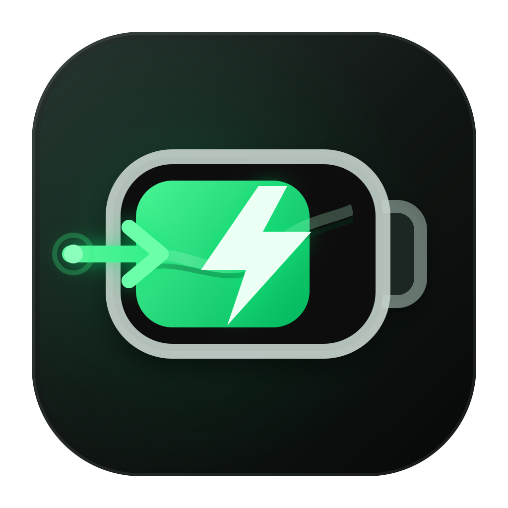

# MacPowerFlow

MacPowerFlow 是一款面向 Apple Silicon Mac 的轻量级菜单栏功耗监视器。它在同一面板中汇总电源适配器、整机、电池以及 CPU、GPU、神经网络引擎和内存功耗，并用主能量流视图展示电力从哪里进入、又被哪些部分消耗。



## 下载

从 [GitHub Releases](https://github.com/liulingfei-1/MacPowerFlow/releases/latest) 下载最新 ZIP，解压后把 `MacPowerFlow.app` 拖入“应用程序”。当前公开包使用 hardened ad-hoc 签名但尚未 Apple 公证；如果 macOS 首次阻止启动，请在 Finder 中右键应用选择“打开”，或前往“系统设置 → 隐私与安全性”确认打开。

## 功能

- 菜单栏把电量数字直接放入电池图标，省略百分号、分隔圆点和额外空格，紧接整机实时负载；充电时电池变绿，未充电时保持系统标签色。
- 用连续块状能量流展示适配器、电池、整机、CPU、GPU、显示和“其他”残差；各流道宽度与实时功耗联动，文字放在与流道连体的安全节点内，极低或极高功耗都不会相互遮挡。
- 主视觉先按同一帧整机预算校验各支路：明显异常的 GPU 瞬时值会回退到最近合理样本，CPU、GPU、显示与“其他”始终保持非负且不会合计超过整机负载。
- 首次启动只请求一次 macOS 管理员批准，用于安装受限的只读增强服务；之后启动应用或重启电脑都会直接连接，不再反复输入密码。
- 展示电池温度、循环次数、按满充/设计容量估算的健康度、容量和预计充满或用尽时间。
- 展示电池与适配器的电压、电流、标称功率，以及实时输入、转换损耗和外接设备输出功率。
- 主视觉直接展示 CPU 与 GPU 功耗；展开区只补充 ANE、DRAM、媒体引擎、ISP、芯片互联和 PCIe 等未在主图中单列的可用分项，避免重复。
- 展示整机功耗、CPU 平均/热点温度、GPU 温度/频率、CPU 集群活跃度与频率、双风扇转速和 DRAM 读写带宽。
- “其他”优先列出 ANE、内存、媒体引擎、无线网络和 USB 等可读通道；没有独立瓦数时，再按整机负载、内存带宽、芯片活跃度与风扇转速动态分配 4–6 个项目。界面只保留紧凑数值，数据口径统一记录在本文档中。
- 列出当前 CPU 占用排序靠前的最多三个进程；这里的百分比不是逐应用功耗瓦数。
- 对缺失或暂时不可用的传感器显示“—”；拿不到管理员 CPU 字段时，会根据可见 SoC 残差或整机负载与 CPU 活跃度给出保守回退值。

功耗采样并非严格同时发生，而且 CPU、GPU、ANE、DRAM 只是整机功耗的一部分。它们的合计不会等于整机功耗；屏幕、SSD、无线模块、电源转换损耗等也会消耗电力。

## 系统要求

- Apple Silicon Mac（M1 或更新系列）。
- macOS 13.0 或更高版本。
- 从源码构建时建议使用 Xcode 26.4 或能够读取当前工程格式的更新版本。

Intel Mac 不在当前支持范围内。没有内置电池的 Mac mini、Mac Studio 和 Mac Pro 会自动显示外接电源视图，不会虚构电池状态。不同芯片、Mac 型号和 macOS 版本公开的传感器名称并不完全一致，因此部分数据可能显示为不可用。

## 构建

### 使用 Xcode

1. 打开 `MacPowerFlow.xcodeproj`。
2. 选择 `MacPowerFlow` scheme 和 “My Mac” 运行目标。
3. 按 `Command-R` 构建并运行。

工程的部署目标是 macOS 13.0，目标架构为 Apple Silicon。应用以菜单栏程序运行，不在 Dock 中显示。

### 构建本地 Release

在项目根目录运行：

```bash
./scripts/build_release.sh
```

脚本会：

1. 在独立临时目录中执行 arm64 Release 构建；
2. 按 helper、安装器、外层 App 的顺序进行 hardened ad-hoc 签名，并逐项验证；
3. 生成并解包复验不携带 Finder 扩展属性的 `dist/MacPowerFlow-1.5.0.zip`；
4. 如果已有旧版本，先把它安全地移动到 `.build/previous-releases/`，而不是直接删除。

分发或安装时使用压缩包：双击解压后，把 `MacPowerFlow.app` 拖入“应用程序”文件夹。发布目录不额外保留裸 `.app`，因为 Finder 或同步目录可能在其上重新附加扩展属性并破坏签名；构建脚本会直接复验 ZIP 解包后的应用。

ad-hoc 签名只适合本机开发和测试；“登录时启动”也应在应用移入“应用程序”文件夹后设置。向其他用户正式分发时，应改用有效的 Developer ID Application 证书，并完成 Apple 公证。

## 使用

启动后，MacPowerFlow 会出现在菜单栏并定期刷新采样。第一次使用这个版本时，macOS 会显示一次管理员认证；通过后，应用安装固定用途的增强服务并立即开始采样。以后重新打开应用或重启电脑都直接连接该服务，不再要求密码。左键点击图标可打开功耗面板；右键点击可立即刷新、设置登录时启动、查看“关于”或退出应用。首次开启“登录时启动”会直接注册主应用；如果 macOS 要求额外批准，菜单会保持半选状态并引导到“系统设置 → 通用 → 登录项与扩展”。用于截图和界面验收的 `--preview` 启动参数会跳过增强服务安装与连接。

应用不需要辅助功能、屏幕录制或完全磁盘访问权限。它不读取或保存密码，也不修改 `sudoers`。首次认证的用途会在系统对话框中说明；只有用户批准后才安装 launchd 管理的 root helper。

### 关于管理员权限

MacPowerFlow 的界面与常规硬件采样始终以当前用户身份运行。首次批准时，一次性安装器只会写入以下固定项目：

- `/Library/PrivilegedHelperTools/com.llf.MacPowerFlow.PrivilegedHelper`
- `/Library/LaunchDaemons/com.llf.MacPowerFlow.PrivilegedHelper.plist`
- `/Library/Application Support/com.llf.MacPowerFlow/helper-config.plist`

root helper 只开放“协议版本、开始采样、停止采样”三个固定 XPC 操作。它不接受客户端传入的命令、可执行路径、参数、环境变量或输出文件；内部只能运行 `/usr/bin/powermetrics` 的固定只读参数。应用退出时只停止当前连续流，不注销 launchd 服务，因此下一次启动无需再次认证。

安装器会把当前 App 的签名标识和精确 CDHash 写入 root 所有、不可由普通用户修改的配置。helper 在接受连接前由系统验证这一精确要求；同名伪造应用不能连接。主应用也会反向验证已安装 helper 与包内 helper 的精确签名哈希。

首次认证期间，主应用不会直接以 root 执行位于普通用户可写 App 包内的安装器。它先让系统自带的 `/usr/bin/install` 把已验签的 helper 与安装器复制到 `/Library/PrivilegedHelperTools` 下两个固定、root 所有的临时路径，再从该只读位置重新比对 identifier 与 CDHash；只有完全一致才运行安装器。安装器不接收来源路径、目标路径或 shell 命令，完成或失败后都会清理临时文件。

管理员流提供 Apple 单独计算的 CPU、GPU、ANE、CPU+GPU+ANE 合计、频率、活跃度和热压力。主视觉中的 CPU / GPU 会逐项优先使用最近且仍然新鲜的增强数据；CPU 字段缺失或授权未完成时，CPU 会回退到本地模型，GPU 缺失时仍使用普通 IOReport 可见值。

`powermetrics` 自己也明确说明这些功耗数字来自能耗模型，可能不准确，而且不适合跨设备比较。为保持面板紧凑，界面不再给数值添加来源前缀；`CPU+GPU+ANE` 合计仍不会被当作整机功耗，“其他”仍由整机负载扣除 CPU、GPU 与显示得到。

当前 ZIP 使用 hardened ad-hoc 签名，安装时会精确绑定当前 1.5.0 App。因此这个版本安装一次后，日常启动与系统重启都不再输入密码；若以后替换 App 二进制，CDHash 会变化，升级后的版本必须再批准一次。这样避免让旧 root helper 无条件信任任意新文件。

若要正式分发并在升级后继续保持稳定身份，应使用同一 Team 的 Developer ID Application 签名、公证，并迁移到 Apple 推荐的 `SMAppService` LaunchDaemon。当前机器没有 Developer ID 身份，因此 1.5.0 采用本机可工作的固定版本安装方式，而没有伪装成一个实际上无法获批的 `SMAppService` 包。

如需完整移除增强服务，可在终端运行以下精确命令；它们只删除 MacPowerFlow 的固定系统项目和可能残留的两个安装临时文件：

```bash
sudo launchctl bootout system/com.llf.MacPowerFlow.PrivilegedHelper 2>/dev/null || true
sudo rm -f /Library/PrivilegedHelperTools/com.llf.MacPowerFlow.PrivilegedHelper
sudo rm -f /Library/PrivilegedHelperTools/.com.llf.MacPowerFlow.PrivilegedHelper.staging
sudo rm -f /Library/PrivilegedHelperTools/.com.llf.MacPowerFlow.PrivilegedInstaller.staging
sudo rm -f /Library/LaunchDaemons/com.llf.MacPowerFlow.PrivilegedHelper.plist
sudo rm -f "/Library/Application Support/com.llf.MacPowerFlow/helper-config.plist"
sudo rmdir "/Library/Application Support/com.llf.MacPowerFlow" 2>/dev/null || true
```

## 数据来源

| 数据 | 来源 | 说明 |
| --- | --- | --- |
| 电池电量、状态、温度、容量、循环、时间 | IOKit `AppleSmartBattery` IORegistry 属性 | IOKit 本身是公开框架，但许多具体属性没有稳定的公开契约 |
| 适配器标称功率和电源遥测 | `AdapterDetails`、`ChargerData`、`PowerTelemetryData` | 字段是否存在取决于机型和系统版本 |
| 整机、适配器、显示、无线网络、USB、SoC 热功耗和芯片温度 | AppleSMC 已知只读键，例如 `PSTR`、`PDTR`、`PDBR`、`wiPm`、`PUSB`、`PHPC` | 启动时枚举 `#KEY` 能力表；只有语义已核对的键进入界面，未知键仅用于诊断 |
| CPU/GPU/ANE/DRAM、GPU SRAM、媒体、ISP、Fabric、PCIe、显示控制器功耗 | IOReport 的 Energy Model / Energy Counters 通道 | 私有、未文档化接口；使用 500ms 相邻能量样本差值抑制短窗尖峰，不同机型只显示实际存在的通道 |
| 管理员 CPU/GPU/ANE 功耗、频率、活跃度和热压力 | Apple `/usr/bin/powermetrics` 的 NUL 分隔 plist 输出 | 首次批准后由受限 root helper 运行固定参数、单条应用会话级连续流；功耗为 Apple 估算值，单位由 mW 换算为 W |
| CPU 回退模型 | 可见 SoC 功耗残差；缺失时使用整机负载与 CPU tick 活跃度的保守曲线 | 仅在拿不到新鲜管理员 CPU 字段和普通 CPU 能量通道时使用 |
| “其他”未覆盖分项模型 | “其他”残差预算与整机负载、内存带宽、芯片活跃度、风扇转速代理信号 | 只分配直接通道未覆盖的剩余量，合计不会超过“其他”预算 |
| CPU 集群活跃度与频率、GPU 使用率与频率 | IOReport 的 CPU Stats / GPU Stats 通道 | 使用 DVFS 状态驻留时间换算 |
| DRAM 读写带宽 | IOReport 的 AMC Stats；新平台回退 PMP DRAM BW | 显示真实活动速率，不把带宽换算为功耗 |
| 风扇转速 | AppleSMC `F0Ac`、`F1Ac` | 只读 RPM；风扇功率没有可靠的通用换算 |
| CPU 使用率 | Mach `host_processor_info` 的相邻 tick 差值 | 系统级 CPU 活跃度 |
| 低电量模式 | Foundation `ProcessInfo` | Apple 提供的公开系统状态接口 |
| 高 CPU 进程 | 系统 `ps` 命令 | 仅采集进程名与 CPU 百分比，不把它描述为逐应用瓦数 |

适配器“标称功率”代表充电器协商或声明的上限，不等同于此刻实际输入功率。界面会把两者分开显示。

## 权限、隐私与发布限制

- 当前实现是只读监视器，不调用 SMC 写入接口。
- 界面和常规监控不以 root 运行；首次用户批准后只安装固定只读 helper，不写入 `/etc/sudoers.d`。
- helper 用当前 App 的精确代码签名要求限制 XPC 客户端，且不提供任意 root 命令接口。
- 数据在本机处理；应用不需要联网，也不包含遥测上报。
- IOReport 和 AppleSMC 不是面向第三方应用承诺兼容性的公开 API，macOS 更新后可能需要适配。
- 由于使用私有接口且关闭 App Sandbox，本项目不适合提交 Mac App Store。
- 推荐使用 Developer ID 签名、公证后在 Mac App Store 之外分发。

## 开源方案

本项目在实现和兼容性处理上参考了 macpow、MacMonitor、Powerflow、WhatBattery 和 mactop，并在管理员采样设计前核对了 macmon、powermetrics-go 与 monmon 对 `powermetrics` 流式 plist 和字段口径的处理，避免重复猜测已有格式。持久 helper 的生命周期还核对了 Apple 的 SMAppService 示例、SecureXPC、Objective-See BlockBlock 和 Lidless；只借鉴受限协议、连接生命周期与签名验证思路，没有复制示例中接受所有客户端或暴露任意 shell 命令的不安全做法。MacPowerFlow 的解析器和固定安装流程按本应用的数据模型独立实现。相关改编项目的版权与许可证见 [THIRD_PARTY_NOTICES.md](THIRD_PARTY_NOTICES.md)。

MacPowerFlow 自身采用 [MIT License](LICENSE)。

发布的 `.app` 会在 `Contents/Resources` 内同时携带自身许可证和第三方声明。
